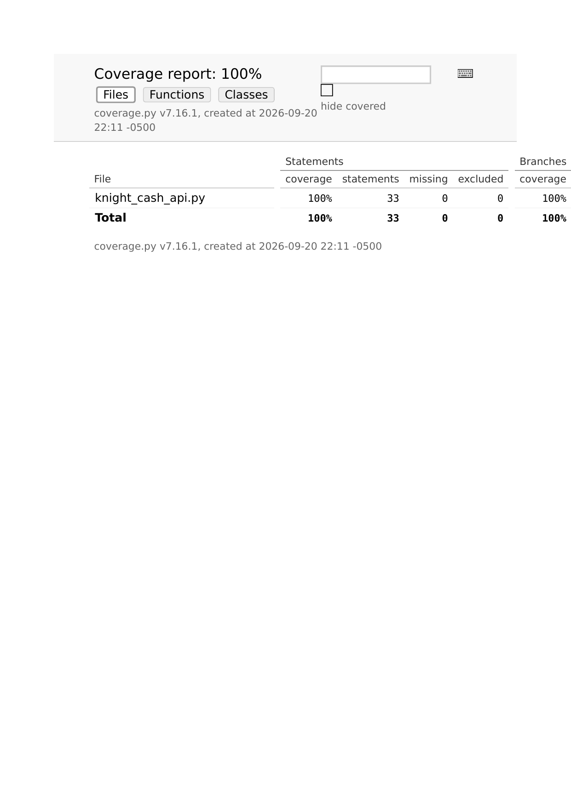

# Week 4 Audit Report: Knight Cash API

## Important Source Note

The required `knight_cash_api.py` starter file was not included with the
assignment materials. To complete the assigned TDD workflow, I reconstructed a
minimal FastAPI module matching the named `/transfer` and `/balance` behaviors.
The test suite and fixes below audit that reconstructed implementation.

## Bug Log

- **Negative or zero transfers could create or move invalid money.** The
  transfer logic originally lacked an explicit positive-value guard. A negative
  transfer could increase the sender's balance while decreasing the recipient's
  balance. I fixed this by rejecting non-finite values and every amount `<= 0`
  with HTTP 400 before changing either balance.
- **Transfers could overdraw an account.** Without an insufficient-funds check,
  a sender could finish with a negative balance. I added a check comparing the
  requested amount to the source balance and return HTTP 400 when the amount is
  too large. A boundary test proves that transferring the exact available
  balance remains valid.
- **Invalid accounts and self-transfers were not safely rejected.** Direct
  dictionary access could cause an unhandled exception, while transferring to
  the same normalized account was logically invalid. I now normalize account
  names, return HTTP 404 for missing source or destination accounts, and return
  HTTP 400 for same-account transfers before any state mutation.

All rejection tests also compare the complete balance store before and after
the request, proving that failed requests do not partially update funds.

## Coverage Proof



The final command was:

```bash
pytest --cov=knight_cash_api --cov-report=html --cov-report=term-missing --cov-branch
```

The final report achieved **100% statement coverage and 100% branch coverage**,
which exceeds the required 95% target.

## Prompt Audit

Exact Step 4 prompt used to close a missed branch:

> Write a specific Pytest case that triggers the insufficient-funds branch in
> `transfer`: `if request.amount > balances[source]`. Verify that the endpoint
> returns HTTP 400, that its response contains `Insufficient funds`, and that
> neither account balance changes. Also add a boundary test where the transfer
> amount exactly equals the source balance to prove the opposite branch remains
> valid.

## GitHub Link

https://github.com/glbequette/knight-cash-audit

